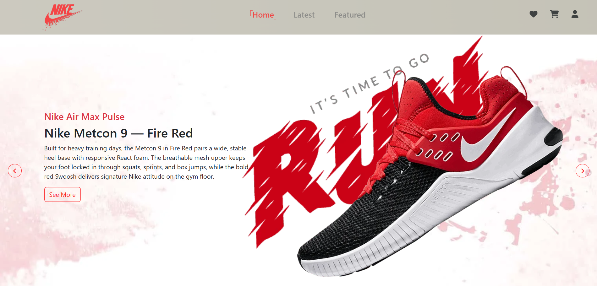
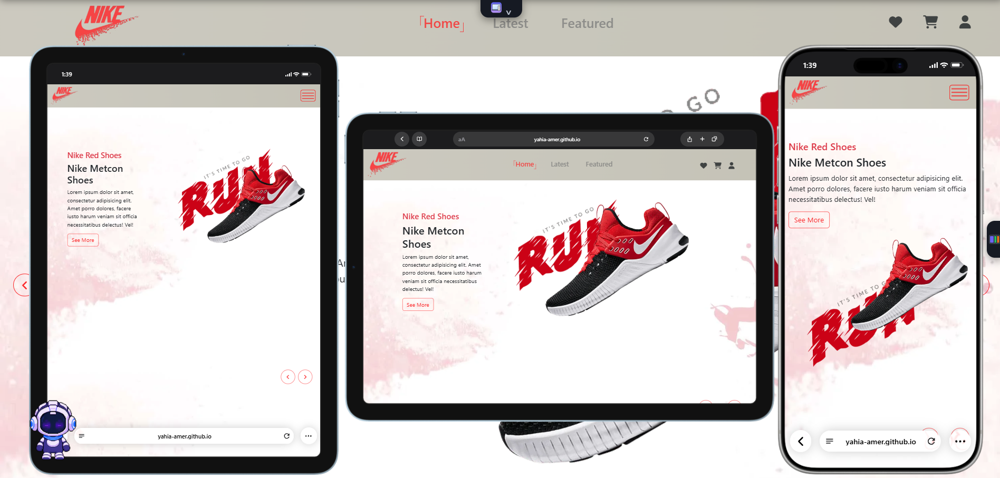

# Nike - E-Commerce Website

A responsive e-commerce website inspired by the Nike online store.

The website focuses on providing a shopping experience with a themed hero carousel, product browsing, product quick view, favorites, shopping cart, user accounts, and a checkout flow.

## Live Demo

[View Live Demo](https://yahia-amer.github.io/Nike/)

## Preview

### Desktop



### Responsive (Tablet & Mobile)



## Features

* Responsive navigation with a mobile burger menu
* Hero carousel with three color themes (red, blue, orange)
* Theme-aware logo and accent colors that change with the active slide
* Keyboard navigation for the carousel (left / right arrow keys)
* Special offer banners
* Latest Products section with image gallery thumbnails, size selection, and quantity control
* Featured Products section with color variants
* Product quick view popup (images, sizes, colors, price, quantity)
* Favorites / wishlist drawer
* Shopping cart drawer with quantity update and item removal
* Client-side user registration and login
* Live password rules and form validation
* User-specific cart and favorites
* Guest cart merged into the user cart after login
* Checkout page with order summary
* Promo codes and shipping calculation
* Payment method selection (Card or Cash On Delivery) with card field validation
* Order confirmation with an order reference
* LocalStorage data persistence
* Cart and favorites synced across browser tabs
* CSS animations and transitions

## Technologies

* HTML5
* CSS3
* JavaScript (Vanilla JS)
* Bootstrap 5
* Font Awesome
* Google Fonts (Nunito)
* LocalStorage / SessionStorage API

## Sections

* Home (Hero Carousel)
* Offers
* Latest Products
* Featured Products
* Quick View
* Favorites
* Cart
* Login / Register
* Checkout
* Footer

## Responsive Design

The website uses custom CSS media queries together with Bootstrap to adapt the layout and content to different screen sizes, including desktop, tablet, and mobile devices.

## User Accounts

The project includes a client-side user account system using LocalStorage.

Each registered user has their own:

* Shopping cart
* Favorites

Logging out ends the current session while keeping the account and its saved data available for future logins.

Checkout requires a logged-in user. Guests who try to check out are redirected to the home page and asked to register or log in.

## Checkout

The checkout page includes:

* Order items review
* Shipping details (name, phone, address, notes)
* Promo code field
* Payment method selection
* Order summary with subtotal, discount, shipping, and total

### Promo Codes

| Code       | Discount   |
| ---------- | ---------- |
| `NIKE10`   | 10% off    |
| `WELCOME5` | $5 off     |
| `SAVE20`   | $20 off    |

### Shipping

* Shipping fee: $29
* Free shipping for orders of $1000 or more

## Project Structure

```text
Nike/
│
├── index.html
├── checkout.html
│
├── css/
│   ├── fonts.css
│   ├── global.css
│   ├── nike.css
│   └── responsive.css 
│
├── js/
│   ├── utils.js
│   ├── navigation.js
│   ├── carousel.js
│   ├── validation.js
│   ├── login.js
│   ├── products.js
│   ├── quick-view.js
│   ├── cart.js
│   ├── favorites.js
│   ├── checkout.js
│   └── main.js
│
└── img/
    ├── logo.png, logo2.png, logo3.png
    ├── home-bg-*.jpg / .webp
    ├── home-shoe-*.webp
    ├── home-text-*.webp
    ├── home-banner-*.webp
    ├── first-correct, second-correct, third-correct (.png / .webp)
    ├── s1.png, s1.webp
    └── products/
        └── 19 products, each with multiple images
            (1-1.webp ... 19-4.webp)
```

## Notes

This project is a front-end e-commerce website. User authentication, cart management, favorites, and orders are implemented on the client side using LocalStorage.

Passwords are stored in the browser only, so this is intended for demonstration and learning purposes and not for real authentication.

The checkout and payment interface are for demonstration purposes only and do not process real payments.

## Author

Yahia Amer

Front-End Developer